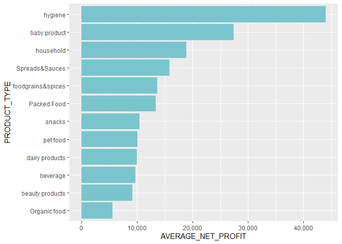

Business Data Analysis Capstone Project
================
Leopoldine Mirtil

### DATA SOURCE

The data used in this Capstone task is from the ‘Application of Data
Analysis in Business with R Programming’ guided project course taught 
by instructor Nilosree Sengupta through Coursera.com.

### SCENARIO

You are provided with a dataset of a departmental store. It contains
details of products from May 2020, a period marked by Covid-19. Your
manager wants you to find out investing in which products will be
more profitable. Your objective is to analyse the patterns and trends of
the products, and gather insights for strategic decision making.(At this
level, you don’t need to make reports/recommendations now. You will
build reports and make recommendations in future, with the knowledge you
gained from this project.)

### PART 1: IMPORT DATA

#### I. LOAD PACKAGES

``` r
require(ggplot2)
library(corrplot)
library(ggcorrplot)
library(tidyverse)
```

#### II. LOAD DATASET

``` r
# set directory
setwd("C:/Users/Leopoldine/Desktop/Mine/Coding Projects & Portfolio/Guided Projects/R Guided Project/Application of Data Analysis in Business with R Programming/Department Store Project")

#load data
store <- read.csv("FINAL DEPARTMENTAL STORE.csv")

# view data
head(store)
```

    ##   UNIQUE_ID                  PRODUCT_NAME COMPANY      PRODUCT_TYPE
    ## 1     GSK59          Z Organic Dates,100g       Z      Organic food
    ## 2     GSK60                Z Walnuts,100g       Z       Packed Food
    ## 3     GSK61           J Organic Figs,100g       J       Packed Food
    ## 4     GSK62        J Organic Walnuts,100g       J      Organic food
    ## 5     GSK63                G Fennel,100 g       G foodgrains&spices
    ## 6     GSK64 J chocolate flavour Oats, 1kg       J       Packed Food
    ##   PRODUCT_CATEGORY COST_PRICE SELLING_PRICE QUANTITY_DEMANDED PROFIT
    ## 1       Dry Fruits     273.64        471.80                22 198.16
    ## 2       Dry Fruits     185.00        212.75               452  27.75
    ## 3       Dry Fruits     220.00        253.00               424  33.00
    ## 4       Dry Fruits     349.16        602.00                23 252.84
    ## 5     Whole Spices      32.34         49.00               551  16.66
    ## 6       Dry Fruits     310.00        356.50               352  46.50
    ##   PROFIT_PERCENT NET_PROFIT
    ## 1       72.41631    4359.52
    ## 2       15.00000   12543.00
    ## 3       15.00000   13992.00
    ## 4       72.41379    5815.32
    ## 5       51.51515    9179.66
    ## 6       15.00000   16368.00

### PART 2: DATA MANIPULATION

#### I. TRANSFORM DATA

``` r
# arrange data in desc order of profit & use first 360 rows
store1 <- arrange(store, desc(PROFIT))%>%
  slice_head(n=360) 

# view data 
head(store1)
```

    ##     UNIQUE_ID                                 PRODUCT_NAME COMPANY PRODUCT_TYPE
    ## 20      GSK78 S PRO ACTIVE health drink  2x400 g Multipack       S     beverage
    ## 167    GSK225 S PRO ACTIVE health drink  2x400 g Multipack       S     beverage
    ## 133    GSK191                          Z Organic Figs,100g       Z Organic food
    ## 190    GSK248                       Z Organic Walnuts,100g       Z Organic food
    ## 24      GSK82                    I Organic Hazel Nuts,100g       I Organic food
    ## 56     GSK114                       I Organic Walnuts,100g       I Organic food
    ##     PRODUCT_CATEGORY COST_PRICE SELLING_PRICE QUANTITY_DEMANDED PROFIT
    ## 20       healthdrink     912.00        1200.0                20 288.00
    ## 167      healthdrink     912.00        1200.0                10 288.00
    ## 133       Dry Fruits     362.96         625.8                65 262.84
    ## 190       Dry Fruits     354.84         611.8                76 256.96
    ## 24        Dry Fruits     353.22         609.0                80 255.78
    ## 56        Dry Fruits     353.22         609.0                27 255.78
    ##     PROFIT_PERCENT NET_PROFIT
    ## 20        31.57895    5760.00
    ## 167       31.57895    2880.00
    ## 133       72.41569   17084.60
    ## 190       72.41574   19528.96
    ## 24        72.41379   20462.40
    ## 56        72.41379    6906.06

#### II. STATISTICAL INTERPRETATION OF DATA

``` r
# find average, max and min of profit by product category
store1 %>%
group_by(PRODUCT_CATEGORY)%>%
  summarise(AVG=mean(PROFIT), MAX=max(PROFIT), MIN=min(PROFIT)) %>%
  print(n=38)
```

    ## # A tibble: 38 × 4
    ##    PRODUCT_CATEGORY   AVG   MAX   MIN
    ##    <chr>            <dbl> <dbl> <dbl>
    ##  1 Dry Fruits        92.7 263.   19.5
    ##  2 Flour             47.0  47.0  47.0
    ##  3 Jam               98.4 102    96  
    ##  4 Powdered Spices   34.8  52.9  20.1
    ##  5 Whole Spices      65.5 200.   20.1
    ##  6 babycare         126.  134   120  
    ##  7 biscuits          20    20    20  
    ##  8 bodycare          64.9 125.   21.5
    ##  9 butter            35    40    30  
    ## 10 cereals           95.5 235.   24  
    ## 11 cheese            20    20    20  
    ## 12 chips             43.6  50    35  
    ## 13 chocolate         31.7  40    20  
    ## 14 detergent        163.  205.  104. 
    ## 15 dishwasher       107.  126    87.6
    ## 16 disinfectant      64.2 107.   52.8
    ## 17 edible oil        41.5  70    24.5
    ## 18 eye-makeup        41.4  50.4  34.4
    ## 19 freshners         84.6  85.2  84  
    ## 20 fruit juice       80.7  87.8  77.0
    ## 21 grains            55.9  82.3  35.3
    ## 22 haircare          66.1  90    30.4
    ## 23 handwash          61.1  61.9  60  
    ## 24 healthdrink      197.  288   120  
    ## 25 lipstick         109.  115.  103. 
    ## 26 mask              62.1  70    50  
    ## 27 milk              65    70    60  
    ## 28 nailpolish        80.9  81.5  80.3
    ## 29 nuggets           42.2  50    35  
    ## 30 oral care         40.6  56.9  22.8
    ## 31 pasta             27.1  37    20  
    ## 32 pet food          51.3  54    50  
    ## 33 pulses(dal)       78.2 112.   47.0
    ## 34 repellents        55.5  69.1  37.2
    ## 35 rice              44.1  47.0  41.2
    ## 36 sanitizer        116.  228    76  
    ## 37 sauce            105.  107.  101. 
    ## 38 soft drinks       26.2  37.2  21.6

### PART 3: DATA VISUALIZATION

#### I. COLUMN PLOT FOR AVERAGE_NET_PROFIT & COMPANY

``` r
store1 %>% 
  group_by(COMPANY, PRODUCT_TYPE) %>% 
  summarise(AVERAGE_NET_PROFIT=mean(NET_PROFIT)) %>%
  ggplot(aes(x=COMPANY, y=AVERAGE_NET_PROFIT, fill=PRODUCT_TYPE))+
  geom_col() +
  scale_y_continuous(labels = scales::comma) 
```

<!-- -->

#### II. SCATTER PLOT FOR SELLING_PRICE & QUANTITY_DEMANDED

``` r
store1 %>%
  ggplot(aes(x=QUANTITY_DEMANDED, y=SELLING_PRICE, color= PRODUCT_CATEGORY))+
  geom_point() +
  theme(legend.title = element_text(angle = 90), legend.title.align = 0.5) +
  guides(colour = guide_legend(title.position = "left", ncol=5)) + 
  theme(legend.position = "bottom") 
```

<!-- -->

#### III. COLUMN CHART OF PROD TYPE & AVERAGE NET PROFIT

``` r
store1 %>% 
  group_by(PRODUCT_TYPE) %>% 
  summarise(AVERAGE_NET_PROFIT=mean(NET_PROFIT, na.rm = TRUE)) %>%
  arrange(desc(AVERAGE_NET_PROFIT)) %>%
  ggplot(aes(x=fct_reorder(PRODUCT_TYPE, +AVERAGE_NET_PROFIT), y=AVERAGE_NET_PROFIT))+
  geom_col(fill="cadetblue3") +
  xlab("PRODUCT_TYPE") +
  scale_y_continuous(labels = scales::comma) +
  coord_flip()
```

<!-- -->

#### IV. HISTOGRAM FOR PROFIT PERCENT AND PRODUCT TYPE

``` r
store1 %>%
  ggplot(aes(x=PROFIT_PERCENT, fill=PRODUCT_TYPE))+geom_histogram(binwidth = 20)
```

<!-- -->

#### V. PIE CHART FOR PRODUCT CATEGORIES OF TOP 3 PRODUCT TYPES & TOTAL NET PROFIT

``` r
store1 %>%
  filter(PRODUCT_TYPE=="hygiene" | PRODUCT_TYPE=="baby product" |PRODUCT_TYPE=="household") %>%
  group_by(PRODUCT_CATEGORY) %>%
  summarise(TOTAL_NET_PROFIT=sum(NET_PROFIT)) %>%
  arrange(desc(PRODUCT_CATEGORY)) %>%
  mutate(percentage=round(TOTAL_NET_PROFIT*100/sum(TOTAL_NET_PROFIT))) %>% 
  mutate(y_pos = cumsum(percentage)-0.5*percentage) %>%
  ggplot(aes(x="", percentage, fill=PRODUCT_CATEGORY))+
  geom_bar(width = 1, stat = "identity", color= "white", alpha=.5)+
  coord_polar("y", start=0)+
  geom_text(aes(y=y_pos, label=paste0(percentage, "%")), color="black")+
  scale_fill_manual(values=rainbow(10))+ theme_void()
```

<!-- -->

### PART 4: CORRELATION

#### I. CORRELATION MATRIX OF THE COMPLETE DATASET

``` r
store<-dplyr::select_if(store, is.numeric)
r<-cor(store, use="complete.obs")
round(r,2)
```

    ##                   COST_PRICE SELLING_PRICE QUANTITY_DEMANDED PROFIT
    ## COST_PRICE              1.00          0.98             -0.54   0.63
    ## SELLING_PRICE           0.98          1.00             -0.59   0.78
    ## QUANTITY_DEMANDED      -0.54         -0.59              1.00  -0.57
    ## PROFIT                  0.63          0.78             -0.57   1.00
    ## PROFIT_PERCENT         -0.16          0.01             -0.36   0.50
    ## NET_PROFIT              0.16          0.20              0.32   0.26
    ##                   PROFIT_PERCENT NET_PROFIT
    ## COST_PRICE                 -0.16       0.16
    ## SELLING_PRICE               0.01       0.20
    ## QUANTITY_DEMANDED          -0.36       0.32
    ## PROFIT                      0.50       0.26
    ## PROFIT_PERCENT              1.00       0.13
    ## NET_PROFIT                  0.13       1.00

#### II. HEAT MAP OF THE CORRELATION MATRIX

``` r
ggcorrplot(r)
```

<!-- -->
